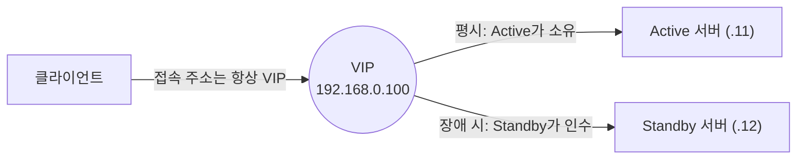
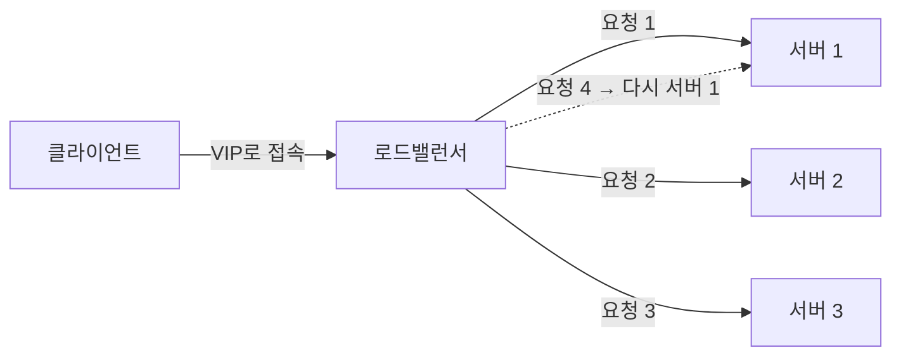

# VIP, Active/Standby, 라운드 로빈

서비스 가용성과 처리량을 높이는 구성에서 함께 등장하는 세 개념이다. 역할을 한 줄로 정리하면:

- **VIP** — 클라이언트가 접속하는 고정 진입점(대표 IP)
- **Active/Standby** — 장애에 대비해 서버를 이중으로 두는 구성
- **라운드 로빈** — 여러 서버에 요청을 돌아가며 분배하는 부하 분산 알고리즘

## VIP (Virtual IP)

VIP는 특정 서버의 NIC에 고정 부여된 물리 IP가 아니라, **소프트웨어적으로 할당하고 다른 서버로 옮길 수 있는 논리 IP**다. 이중화 구성에서 서버군의 대표 주소로 쓰인다.

클라이언트는 서버 각각의 실제 IP가 아니라 VIP 하나만 바라본다. 장애가 발생하면 VIP를 살아 있는 서버로 옮기므로, **클라이언트 쪽 설정 변경 없이** 서비스가 유지된다. 이것이 VIP의 존재 이유다.

### 구현 방식

| 방식             | 동작                                           | 예                              |
| ---------------- | ---------------------------------------------- | ------------------------------- |
| VRRP             | 서버들이 우선순위를 두고 VIP 소유권을 주고받음 | Keepalived, VRRP 라우터         |
| 로드밸런서       | LB가 VIP를 소유하고 뒷단 실제 서버로 분배      | L4 스위치, HAProxy, Nginx       |
| 솔루션 자체 기능 | 이중화 솔루션이 접속용 VIP를 관리              | Oracle RAC(SCAN VIP), MySQL MHA |

### Keepalived(VRRP) 설정 예

```bash
# /etc/keepalived/keepalived.conf — Active(MASTER)
vrrp_instance VI_1 {
    state MASTER            # Standby 쪽은 BACKUP
    interface eth0
    virtual_router_id 51    # 쌍을 이루는 두 서버가 같아야 함
    priority 150            # Standby 쪽은 100 (높은 쪽이 MASTER)
    advert_int 1            # VRRP 광고 주기(초)
    virtual_ipaddress {
        192.168.0.100/24    # VIP
    }
}
```

### 장애 시 동작 (failover)

1. MASTER가 VRRP 광고(advert)를 보내지 않는다 (프로세스·서버 장애, 네트워크 단절)
2. BACKUP가 광고 수신 타임아웃을 감지한다 (기본 약 3초)
3. BACKUP가 자신을 MASTER로 승격하고 VIP를 자신에게 부착한다
4. 무료 ARP(gratuitous ARP)로 스위치·라우터의 ARP 테이블을 갱신한다
5. 클라이언트는 계속 같은 VIP로 접속한다 — 뒤에서 서버가 바뀌었다는 사실을 모른다

## Active / Standby (액티브/스탠바이)

이중화 구성에서 **Active(주 서버)**가 서비스를 처리하고 **Standby(대기 서버)**가 장애에 대비한다. Standby의 대기 수준과, 반대로 모든 서버가 서비스하는 구성까지 포함해 다음과 같이 나뉜다.

| 구분          | 평시 동작                           | 장애 시                        | 비고                          |
| ------------- | ----------------------------------- | ------------------------------ | ----------------------------- |
| Hot Standby   | Standby가 가동 상태로 데이터 동기화 | 즉시 승격 (수 초)              | DB 이중화의 일반적인 형태     |
| Cold Standby  | Standby는 전원 오프/미구성          | 수동 가동·복구 (수 분~수 시간) | 비용은 낮지만 복구 느림       |
| Active/Active | 모든 노드가 동시에 서비스           | 남은 노드가 트래픽 흡수        | 자원 활용 극대화, 동기화 복잡 |

Active/Active는 웹 서버 군처럼 상태가 없는(stateless) 서비스에 자연스럽고, Active/Standby는 DB처럼 데이터 일관성 때문에 단일 진입점이 필요한 서비스에 많이 쓰인다(Oracle Data Guard의 Primary/Standby 등).

### 장애 조치 흐름



1. Active 장애를 감지한다 (heartbeat, 헬스 체크)
2. Standby를 Active로 승격한다
3. VIP를 승격된 서버로 이동한다
4. 이 과정에 수 초의 끊김이 발생할 수 있다 — 무중단이 아니라 **가용성 확보**가 목적이다

## 라운드 로빈 (Round Robin)

요청을 받은 순서대로 서버를 순회하며 하나씩 분배하는 부하 분산 알고리즘이다. 1번 → 2번 → 3번 → 다시 1번. 가장 단순해서 모든 서버의 성능이 비슷하고 요청 비용이 균일할 때 잘 동작한다.



### DNS 라운드 로빈

도메인 하나에 A 레코드를 여러 개 두고, 조회할 때마다 순서를 순환시키는 가장 간단한 형태다.

```text
www.example.com.  IN  A  192.168.0.11
www.example.com.  IN  A  192.168.0.12
www.example.com.  IN  A  192.168.0.13
```

한계가 뚜렷하다:

- **DNS 캐싱** — TTL 동안 같은 IP로만 접속되어 분배가 고르지 않다
- **헬스 체크 없음** — 서버가 죽어도 DNS는 계속 해당 IP를 돌려준다
- 분배 비용 자체는 거의 들지 않지만, 그만큼 정교함이 없다

### 로드밸런서 라운드 로빈과 주의점

L4/L7 로드밸런서의 라운드 로빈은 헬스 체크를 병행해 죽은 서버를 분배 대상에서 제외한다. 다만 두 가지를 주의해야 한다.

- **서버 성능 차이 무시** — 사양이 낮은 서버에도 똑같이 분배되어 병목이 될 수 있다
- **세션 불일치** — 상태를 서버 메모리에 저장하는 앱(로그인 세션 등)은 매 요청이 다른 서버로 가면 상태가 어긋난다. 스티키 세션(같은 클라이언트를 같은 서버로) 또는 [[redis-java-client|Redis]] 같은 외부 세션 저장소로 해결한다

### 다른 부하 분산 알고리즘과 비교

| 알고리즘             | 분배 기준          | 적합한 상황                |
| -------------------- | ------------------ | -------------------------- |
| Round Robin          | 순서               | 서버 규격·요청 비용이 균일 |
| Weighted Round Robin | 순서 + 가중치      | 서버 성능 차이 반영        |
| Least Connection     | 현재 연결 수       | 요청 처리 시간이 제각각    |
| IP Hash              | 클라이언트 IP 해시 | 세션 유지가 필요한 경우    |

## 세 개념의 관계

| 개념           | 해결하려는 문제   | 역할                                       |
| -------------- | ----------------- | ------------------------------------------ |
| VIP            | 접속 주소 고정    | 장애 전환 시 클라이언트가 알아챌 필요 없음 |
| Active/Standby | 단일 장애점(SPOF) | 장애 발생 시 서비스를 대기 서버가 인계     |
| 라운드 로빈    | 처리량 병목       | 트래픽을 여러 서버에 분산                  |

전형적인 조합 두 가지:

- **이중화형** — VIP + Active/Standby 2대. 평시 한 대는 유휴지만 장애 시 즉시 인계한다. DB나 단일 인스턴스 WAS에 많다
- **분산형** — VIP(로드밸런서 소유) + Active/Active 서버 군 + 라운드 로빈. 웹·API 서버에 많다

즉 VIP는 "어디로 접속할지", Active/Standby는 "죽으면 누가 이어받을지", 라운드 로빈은 "여러 대에 어떻게 나눌지"를 각각 담당하며, 실제 운영 환경에서는 셋을 겹쳐 구성한다.

## 관련 페이지

- [[nfs-samba-server]] — 이중화 대상이 되는 파일·공유 서버 구성
- [[redis-java-client]] — 라운드 로빈 환경의 세션 공유 저장소로 쓰이는 Redis
- [[docker-usage]] — 컨테이너 기반으로 서버 군을 늘리는 기반
